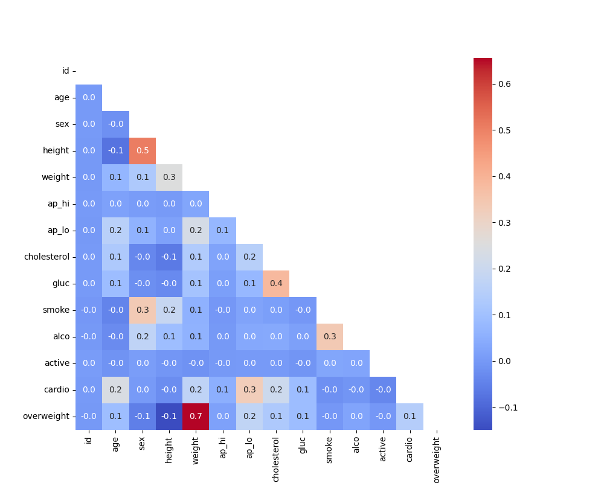

# Medical Data Visualizer

## Overview
The **Medical Data Visualizer** is a Python project that processes and visualizes medical dataset trends. This tool provides visualizations to analyze patient data and health metrics. Instructions for building the project can be found [here](https://www.freecodecamp.org/learn/data-analysis-with-python/data-analysis-with-python-projects/medical-data-visualizer).

## Features
- **Data Cleaning & Preprocessing**: Handles missing values, standardizes formats, and prepares data for analysis.
- **Statistical Analysis**: Computes key health metrics such as BMI, cholesterol levels, and blood pressure.
- **Data Visualization**:
  - Scatter plots for correlation analysis
  - Categorical plots for health trends
  - Heatmaps for feature relationships
- **Customizable Filters**: Allows users to filter and analyze specific patient groups.

## Installation
### Prerequisites
Ensure you have Python 3 installed along with the following libraries:

```bash
pip install pandas numpy seaborn matplotlib
```

### Clone Repository
```bash
git clone https://github.com/ibringfaith/medical-data-visualizer.git
cd medical-data-visualizer
```

## Usage
Run the Python script to generate visualizations:
```bash
python medical_data_visualizer.py
```
Modify parameters in the script to customize the analysis.

## Example
Here’s an example of a generated heatmap illustrating the correlation between health metrics:


## Testing
To run tests and validate functionality, execute:
```bash
pytest test_medical_visualizer.py
```
Ensure all tests pass before making changes.
